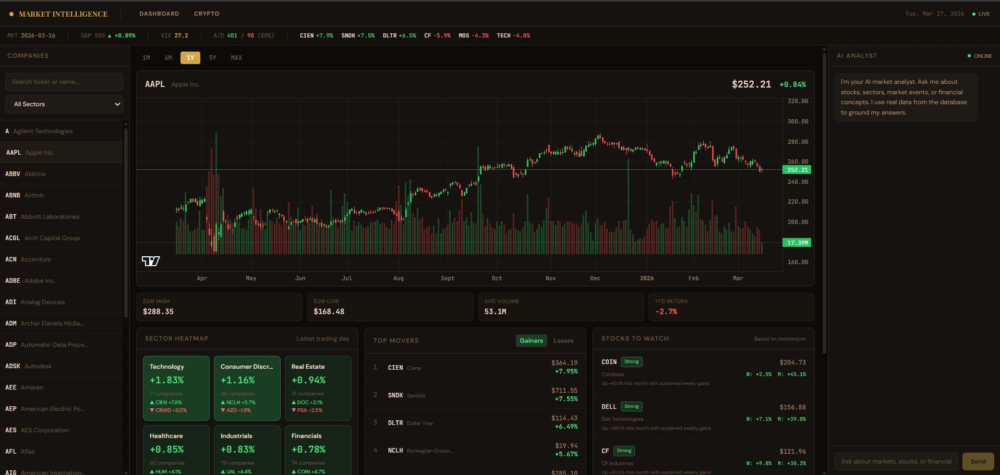
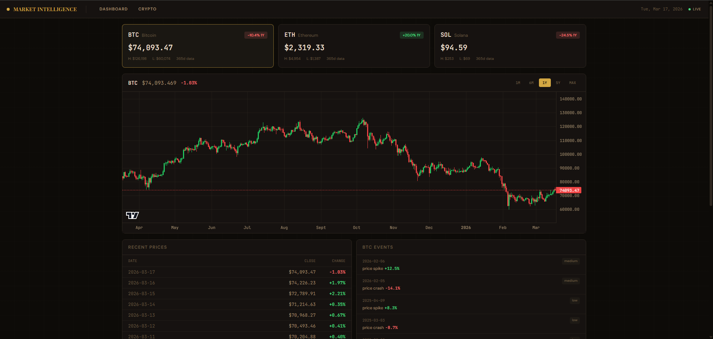
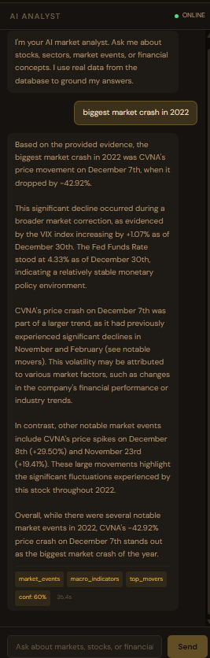
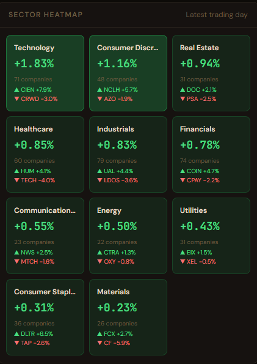

# Market Intelligence Terminal

A production-grade financial intelligence platform that combines 35+ years of market data with AI-powered analysis. Built with PostgreSQL, TimescaleDB, FastAPI, Next.js, and local LLMs via Ollama.

This is not a tutorial project. It ingests 3.7 million rows of real stock data, detects market anomalies automatically, and answers financial questions using a two-model AI architecture grounded in database evidence.



---

## What It Does

Ask the AI analyst: *"Why did NVIDIA rise in 2023?"*

The system queries the database, finds NVDA's +246% return, pulls semiconductor sector performance data, retrieves relevant market events, checks macroeconomic conditions (Fed rate at 5.33%, VIX at 12.45), and generates a data-grounded explanation. No hallucination — every claim is backed by real numbers from the database.

---

## Key Features

**Historical Market Analysis (1990 → Present)**
- 3.7M+ daily OHLCV records across 503 S&P 500 companies
- 36 years of continuous trading data with computed daily percent changes
- Full crypto coverage: Bitcoin (2014+), Ethereum (2017+), Solana (2020+)
- 6 macroeconomic indicators from FRED: Fed Funds Rate, CPI, GDP, Unemployment, 10Y Treasury, VIX

**Automated Event Detection**
- 70,000+ detected market events across 36 years
- Price spikes and crashes (single stock moves > 8%)
- Market-wide crashes (20+ companies dropping > 5% on the same day)
- Sector-wide movements (5+ companies in one sector moving > 3% together)
- Events stored with severity ratings: low, medium, high, critical

**AI Market Analyst (Two-Model Architecture)**
- Query Router (Mistral): classifies questions in <1 second
- Evidence Builder: gathers structured financial signals from the database
- Market Analyst (Llama3): generates explanations grounded in real data
- Four query categories: finance knowledge, market data, historical analysis, off-topic

**Cross-Period Comparison Engine**
- Compare any stock, sector, or crypto across two time periods
- AAPL 2008 (-55.71%) vs 2023 (+54.80%) with volatility, best/worst days, volume
- Sector comparison: pre-COVID vs post-COVID with direction indicators
- Full diff metrics: return difference, volatility difference, relative ranking

**Sector Performance Heatmap**
- 11 GICS sectors with precomputed daily performance (100K+ rows)
- Sub-5ms API response using precomputed aggregation table
- Top gainer and loser per sector per day
- Historical heatmap for any date from 1990 to present

**Top Movers Engine**
- Daily, weekly, and monthly gainers/losers
- SQL window functions for period return calculation
- Crypto movers with the same period support
- Historical movers for any date

**Daily Automation**
- APScheduler runs at 4:30 PM ET (after US market close)
- Incremental update: fetches last 5 days only (3-4 minutes vs 60 minutes for full)
- Automatic event detection on new data
- Idempotent: safe to re-run without creating duplicates

---

## System Architecture

```
┌─────────────────────────────────────────────────────────────────┐
│                        DATA SOURCES                             │
│                                                                 │
│   yfinance ──────┐                                              │
│   (503 stocks)   │                                              │
│                  ▼                                               │
│   yfinance ──► PYTHON DATA PIPELINE                             │
│   (BTC/ETH/SOL)  │  download → clean → validate → compute %    │
│                  │  → detect events → store                     │
│   FRED API ──────┘                                              │
│   (6 indicators)     │                                          │
│                      ▼                                          │
│   ┌──────────────────────────────────────────────────────┐      │
│   │          POSTGRESQL 16 + TIMESCALEDB                 │      │
│   │                                                      │      │
│   │  stocks ─────────── 3.7M rows [HYPERTABLE]           │      │
│   │  crypto_prices ──── 9.4K rows [HYPERTABLE]           │      │
│   │  companies ──────── 503 S&P 500 companies            │      │
│   │  market_events ──── 70K+ detected events             │      │
│   │  macro_events ───── 32K+ economic data points        │      │
│   │  sector_performance  100K+ precomputed rows          │      │
│   │  sectors ────────── 11 GICS sectors                  │      │
│   │  market_regimes ─── regime detection (extensible)    │      │
│   └──────────────┬───────────────────────────────────────┘      │
│                  │                                               │
│                  ▼                                               │
│   ┌──────────────────────────────────────────────────────┐      │
│   │              FASTAPI REST API                        │      │
│   │                                                      │      │
│   │  /api/stocks      /api/crypto     /api/events        │      │
│   │  /api/sectors     /api/movers     /api/heatmap       │      │
│   │  /api/compare     /api/market     /api/ai/chat       │      │
│   └──────────┬──────────────────┬────────────────────────┘      │
│              │                  │                                │
│              │                  ▼                                │
│              │   ┌──────────────────────────────────┐           │
│              │   │     AI ENGINE (Ollama Local)     │           │
│              │   │                                  │           │
│              │   │  User Query                      │           │
│              │   │    ▼                              │           │
│              │   │  Mistral ─► Query Router          │           │
│              │   │    ▼                              │           │
│              │   │  Evidence Builder (DB queries)    │           │
│              │   │    ▼                              │           │
│              │   │  Llama3 ─► Market Analyst         │           │
│              │   │    ▼                              │           │
│              │   │  Data-Grounded Response           │           │
│              │   └──────────────────────────────────┘           │
│              │                                                   │
│              ▼                                                   │
│   ┌──────────────────────────────────────────────────────┐      │
│   │           NEXT.JS FRONTEND                           │      │
│   │                                                      │      │
│   │  ┌─────────┐  ┌──────────────┐  ┌────────────┐      │      │
│   │  │  LEFT   │  │   CENTER     │  │   RIGHT    │      │      │
│   │  │         │  │              │  │            │      │      │
│   │  │ Company │  │ Candlestick  │  │ AI Chat    │      │      │
│   │  │ Search  │  │ Chart        │  │ Panel      │      │      │
│   │  │         │  │              │  │            │      │      │
│   │  │ Sector  │  │ Stock Detail │  │ Evidence   │      │      │
│   │  │ Filter  │  │ Metrics      │  │ Sources    │      │      │
│   │  │         │  │              │  │            │      │      │
│   │  │         │  │ Heatmap      │  │ Confidence │      │      │
│   │  │         │  │ Top Movers   │  │ Score      │      │      │
│   │  │         │  │ Suggestions  │  │            │      │      │
│   │  └─────────┘  └──────────────┘  └────────────┘      │      │
│   └──────────────────────────────────────────────────────┘      │
└─────────────────────────────────────────────────────────────────┘
```

---

## AI System Design

The AI uses a three-stage pipeline that prevents hallucination by grounding every response in database evidence.

### Stage 1: Query Router (Mistral)

Classifies incoming questions in under 1 second:

| Category | Example | Action |
|---|---|---|
| `finance_knowledge` | "What is inflation?" | Direct LLM response (no DB needed) |
| `market_data` | "Why did Tesla drop in 2022?" | Build evidence → analyze |
| `historical_analysis` | "Biggest crashes since 2000" | Build evidence → analyze |
| `off_topic` | "What's the weather?" | Polite redirect |

### Stage 2: Evidence Builder

Queries the database for structured financial signals before the LLM sees anything:

```json
{
  "company_data": {
    "NVDA": {
      "period_return": 246.10,
      "price_range": "$14.25 - $50.37",
      "biggest_moves": [
        {"date": "2023-05-25", "pct_change": 24.37},
        {"date": "2023-02-23", "pct_change": 14.02}
      ]
    }
  },
  "sector_performance": {"Technology": {"avg_daily_change": 0.5338}},
  "market_events": [...],
  "macro_events": [
    {"indicator": "fed_funds_rate", "value": 5.33},
    {"indicator": "vix", "value": 12.45}
  ],
  "confidence_score": 0.8,
  "data_points": 290
}
```

### Stage 3: Market Analyst (Llama3)

Receives the structured evidence and generates an explanation. The system prompt instructs the model to reference specific numbers and dates from the evidence, never invent data, and acknowledge when evidence is insufficient.

**Why this matters:** Most AI finance tools generate responses from training data alone. This system queries 3.7M real data points and passes structured evidence to the LLM. The confidence score tells the user how much evidence was available.

---

## Technology Stack

| Layer | Technology | Purpose |
|---|---|---|
| Database | PostgreSQL 16 + TimescaleDB | Time-series optimized storage |
| Backend | FastAPI + SQLAlchemy 2.0 | REST API with ORM |
| AI Runtime | Ollama (local) | Privacy-preserving LLM inference |
| AI Models | Llama3 + Mistral | Analyst + Router |
| Frontend | Next.js 14 + Tailwind CSS | Trading terminal UI |
| Charts | Lightweight Charts | Financial candlestick rendering |
| Scheduler | APScheduler | Daily automated updates |
| Data Sources | yfinance, FRED API | Free market data |
| Config | pydantic-settings | Type-safe environment management |

---

## Database Design

### TimescaleDB Hypertables

The `stocks` and `crypto_prices` tables are TimescaleDB hypertables, partitioned into 365-day chunks. This means a query for "AAPL from 2020 to 2023" only scans 3-4 chunks instead of the entire 3.7M row table.

```
stocks (HYPERTABLE — 3.7M rows, 37 chunks)
├── date (timestamptz) ── partition key
├── company_id (FK → companies)
├── open, high, low, close (numeric)
├── volume (bigint)
└── pct_change (numeric) ── precomputed daily return
```

### Precomputed Aggregation

The `sector_performance` table stores precomputed daily sector averages (100K+ rows). This reduces heatmap API response from ~200ms (live aggregation across millions of rows) to ~5ms (single indexed lookup).

### Schema Overview

| Table | Rows | Purpose |
|---|---|---|
| `stocks` | 3,638,974 | Daily OHLCV, hypertable |
| `companies` | 503 | S&P 500 company metadata |
| `crypto_prices` | 9,416 | BTC/ETH/SOL daily prices, hypertable |
| `market_events` | 70,056 | Detected anomalies and crashes |
| `macro_events` | 32,426 | Fed rate, CPI, GDP, VIX, etc. |
| `sector_performance` | 100,276 | Precomputed heatmap data |
| `sectors` | 11 | GICS sector definitions |
| `crypto_assets` | 3 | Crypto asset definitions |
| `market_regimes` | — | Extensible regime detection |

---

## API Endpoints

All endpoints support date range filtering. Swagger documentation at `http://localhost:8000/docs`.

| Endpoint | Method | Description |
|---|---|---|
| `/api/stocks` | GET | List/search companies |
| `/api/stocks/{ticker}` | GET | Price history with date range |
| `/api/crypto` | GET | List crypto assets |
| `/api/crypto/{symbol}` | GET | Crypto price history |
| `/api/events` | GET | Market events with filters |
| `/api/sectors` | GET | Sector list with counts |
| `/api/sectors/{name}` | GET | Drill-down with per-company performance |
| `/api/heatmap` | GET | Sector heatmap for any date |
| `/api/heatmap/history` | GET | Sector performance over time |
| `/api/movers/gainers` | GET | Top gainers (daily/weekly/monthly) |
| `/api/movers/losers` | GET | Top losers (daily/weekly/monthly) |
| `/api/movers/summary` | GET | Both in one call |
| `/api/compare/stock` | GET | Compare stock across two periods |
| `/api/compare/sector` | GET | Compare sectors across two periods |
| `/api/compare/crypto` | GET | Compare crypto across two periods |
| `/api/market/overview` | GET | Market summary (S&P, VIX, A/D) |
| `/api/market/suggestions` | GET | Momentum-based stock picks |
| `/api/ai/chat` | POST | AI analyst question answering |

### Example: Compare AAPL in 2008 vs 2023

```
GET /api/compare/stock?ticker=AAPL&p1_start=2008-01-01&p1_end=2008-12-31&p2_start=2023-01-01&p2_end=2023-12-31
```

Response:
```json
{
  "ticker": "AAPL",
  "primary": {"total_return": -55.71, "volatility": 3.42},
  "comparison": {"total_return": 54.80, "volatility": 1.19},
  "diff": {"return_diff": -110.51, "direction": "comparison_better"}
}
```

---

## Installation

### Prerequisites

- Python 3.10+
- Node.js 18+
- PostgreSQL 16 + TimescaleDB
- Ollama with `llama3` and `mistral` models
- Git

### Setup

```bash
# Clone
git clone https://github.com/yourusername/market-intelligence-terminal.git
cd market-intelligence-terminal

# Python environment
python -m venv venv
source venv/bin/activate  # Windows: venv\Scripts\activate
pip install -r requirements.txt

# Environment config
cp .env.example .env
# Edit .env with your database credentials

# Database
psql -U postgres -c "CREATE USER market_user WITH PASSWORD 'market_pass_2024';"
psql -U postgres -c "CREATE DATABASE market_intelligence OWNER market_user;"
psql -U market_user -d market_intelligence -c "CREATE EXTENSION IF NOT EXISTS timescaledb;"

# Initialize schema
python scripts/init_database.py

# Load historical data (30-60 min for stocks, 5 min for crypto+macro)
python scripts/seed_database.py

# Precompute sector performance (5-10 min)
python -c "from backend.data_pipeline.sector_engine import compute_sector_performance; compute_sector_performance()"

# Ollama models
ollama pull llama3
ollama pull mistral

# Start API
uvicorn backend.api.main:app --reload --port 8000 --timeout-keep-alive 300

# Start frontend (new terminal)
cd frontend
npm install
npm run dev
```

Open `http://localhost:3000` — the dashboard loads with real market data.

### Daily Updates

```bash
# Manual update (2-5 min)
python scripts/run_pipeline.py daily

# Start scheduler daemon (runs at 4:30 PM ET automatically)
python scripts/run_pipeline.py scheduler
```

---

## Example AI Queries

**Market data question:**
> "Why did NVIDIA rise in 2023?"

Response references: NVDA +246.10% return, biggest single-day moves (May 25: +24.37%, Feb 23: +14.02%), Technology sector avg +0.53% daily, Fed rate at 5.33%, VIX at 12.45. Confidence: 80%.

**Historical analysis:**
> "What happened during the 2020 COVID crash?"

Response references: 11/11 sectors negative on March 16 2020, Real Estate worst at -18.09%, 659 market-wide crash events detected in database.

**Cross-period comparison:**
> "Compare Apple in 2008 vs 2023"

Response: 2008 return -55.71% vs 2023 return +54.80%. Return difference: -110.51%. Volatility dropped from 3.42 to 1.19.

**Finance knowledge:**
> "What is inflation?"

Direct LLM response without database query. Classified as `finance_knowledge` by the router.

---

## Performance

| Metric | Value |
|---|---|
| Total stock data | 3,638,974 rows |
| Historical range | 1990 → present (36 years) |
| Companies tracked | 503 (S&P 500) |
| Market events detected | 70,056 |
| Heatmap API response | ~5ms (precomputed) |
| Daily update time | 3-4 minutes |
| Full historical load | 30-60 minutes (one-time) |
| AI response time | 30-60 seconds (local LLM) |

TimescaleDB hypertables with 365-day chunk intervals allow range queries across decades to complete in milliseconds. Precomputed sector performance eliminates runtime aggregation across 3.7M rows.

---

## Project Structure

```
market-intelligence-terminal/
├── backend/
│   ├── ai_engine/          # LLM integration
│   │   ├── analyst.py      # Llama3 market analyst
│   │   ├── router.py       # Mistral query router
│   │   └── prompts.py      # System prompts
│   ├── analysis/           # Intelligence modules
│   │   ├── comparison_engine.py   # Cross-period comparison
│   │   └── evidence_builder.py    # Structured evidence for AI
│   ├── api/                # FastAPI REST endpoints
│   │   ├── main.py         # App entry point
│   │   ├── dependencies.py # DB session injection
│   │   └── routes/         # 9 route modules
│   └── data_pipeline/      # Data ingestion
│       ├── stocks.py       # S&P 500 via yfinance
│       ├── crypto.py       # BTC/ETH/SOL via yfinance
│       ├── macro.py        # FRED economic data
│       ├── events.py       # Anomaly detection engine
│       ├── sector_engine.py # Precomputed sector perf
│       ├── daily_update.py # Incremental daily update
│       └── scheduler.py    # APScheduler automation
├── config/
│   └── settings.py         # Pydantic-settings config
├── database/
│   ├── models.py           # 9 SQLAlchemy table models
│   └── session.py          # Engine + session factory
├── frontend/               # Next.js 14 dashboard
│   ├── app/                # Pages (dashboard, crypto)
│   └── components/         # 8 React components
├── scripts/                # CLI tools + validation
│   ├── init_database.py    # Schema + seed data
│   ├── seed_database.py    # Full historical load
│   ├── run_pipeline.py     # Pipeline runner
│   └── validate_*.py       # Phase validation tests
├── .env.example            # Required env variables
├── requirements.txt        # Python dependencies
└── README.md
```

---

## Screenshots

| Dashboard | Crypto Page |
|---|---|
|  |  |

| AI Chat | Sector Heatmap |
|---|---|
|  |  |

*Replace placeholder images with actual screenshots of your running dashboard.*

---

## Future Improvements

- **Real-time streaming** — WebSocket price feeds for live updates
- **Advanced forecasting** — LSTM/transformer models for price prediction
- **Portfolio tracking** — personal watchlists with P&L tracking
- **Global markets** — extend beyond S&P 500 to international exchanges
- **Options data** — implied volatility surfaces and Greeks
- **Sentiment analysis** — financial news NLP via Finnhub integration
- **Market regime detection** — automated bull/bear classification (schema ready)
- **Relationship graph** — NetworkX correlation graph between companies (schema ready)
- **Scenario simulation** — "What if rates rise 1%?" historical pattern matching

---

## License

MIT

---

*Built as a portfolio project demonstrating AI engineering, data engineering, and full-stack development.*
