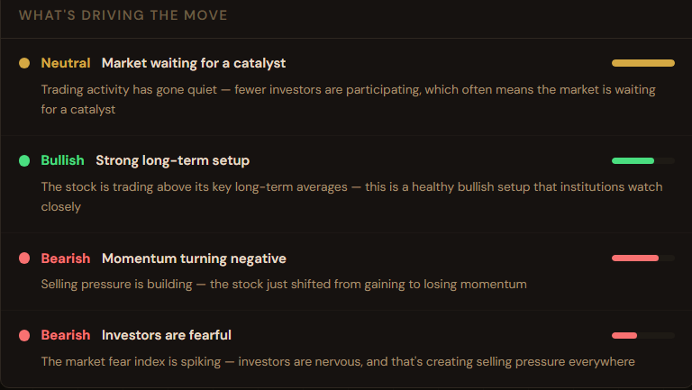
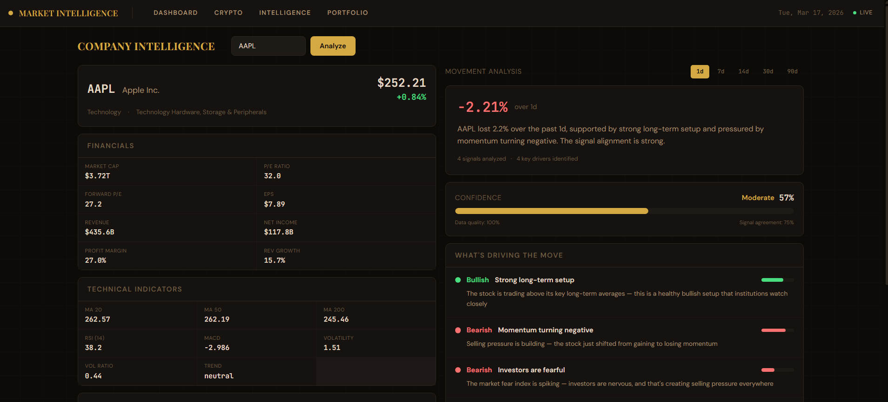
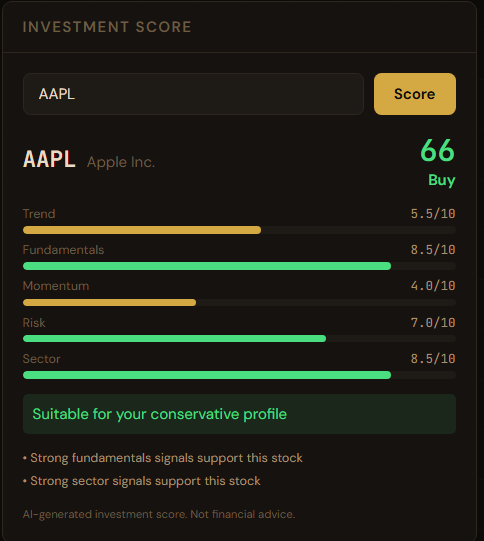
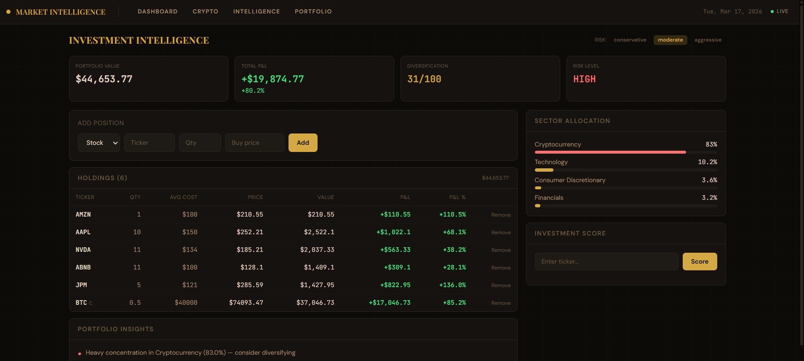

# Market Intelligence Terminal

A production-grade financial intelligence platform that combines 35+ years of market data with AI-powered analysis, a deterministic movement attribution engine, and a portfolio intelligence system. Built with PostgreSQL, TimescaleDB, FastAPI, Next.js, and local LLMs via Ollama.

This is not a tutorial project. It ingests 3.7 million rows of real stock data, precomputes 3.5 million technical indicators, detects market anomalies automatically, explains why stocks move using scored signals, and provides investment intelligence with portfolio tracking.


---

## What It Does

**Ask the AI analyst:** *"Why did NVIDIA rise in 2023?"*

The system queries the database, finds NVDA's +246% return, pulls sector performance data, retrieves relevant market events, checks macroeconomic conditions, and generates a data-grounded explanation. No hallucination — every claim is backed by real numbers.

**Check any stock's intelligence:** Open the Company Intelligence Terminal, type AAPL, and see fundamentals, technical indicators, institutional holders, movement drivers, confidence scores, and support/resistance zones — all computed from real data.

**Build and analyze a portfolio:** Add holdings, track P&L in real-time, get diversification scores, sector breakdown, risk assessment, and actionable warnings like "Overexposed to Technology (68%)."

---

## Key Features

**Historical Market Analysis (1990 → Present)**
- 3.7M+ daily OHLCV records across 503 S&P 500 companies
- 36 years of continuous trading data with computed daily percent changes
- Full crypto coverage: Bitcoin (2014+), Ethereum (2017+), Solana (2020+)
- 6 macroeconomic indicators from FRED: Fed Funds Rate, CPI, GDP, Unemployment, 10Y Treasury, VIX

**Movement Attribution Engine**
- Deterministic pipeline: data → signal extraction → scoring → driver selection → explanation
- 5 signal modules: price, volume, sector, macro, event
- Each signal scored with factor, impact, strength (0-1), and confidence (0-1)
- Driver selection with category diversity (max 2 per category, max 4 total)
- Confidence system: data quality × signal agreement × weighted average
- LLM formats the output — it does NOT reason or invent
- 3.5M precomputed technical indicators (MA20/50/200, RSI, MACD, volatility)



**Company Intelligence Terminal**
- Full company profile: financials, market cap, P/E, EPS, revenue, margins
- Technical indicators: moving averages, RSI, MACD, trend direction
- Institutional holders from yfinance (top 10)
- Company relationships graph: suppliers, partners, competitors
- Support/resistance zones from 60-day price cluster analysis
- Buy/sell zones labeled as statistical estimates (not predictions)



**Investment Scoring System**
- 0-100 investment score per stock based on 5 weighted factors
- Factors: trend (25%), fundamentals (20%), momentum (20%), risk (20%), sector (15%)
- Rating: Strong Buy (80+), Buy (65-79), Hold (40-64), Avoid (below 40)
- Risk profiling: conservative, moderate, aggressive
- Suitability matching: "Suitable for your moderate profile" or "May not suit"



**Portfolio Intelligence**
- Track holdings with buy price, quantity, and real-time P&L
- Supports stocks and crypto (BTC, ETH, SOL)
- Sector allocation breakdown with visual bars
- Diversification score (0-100) based on holdings count, sector spread, concentration
- Risk assessment: low, moderate, high
- Actionable insights: overexposure warnings, missing sector suggestions, loss alerts
- Persistent storage in PostgreSQL (survives restarts)



**Automated Event Detection**
- 70,000+ detected market events across 36 years
- Price spikes and crashes (single stock moves > 8%)
- Market-wide crashes (20+ companies dropping > 5% on the same day)
- Sector-wide movements (5+ companies in one sector moving > 3% together)
- Events stored with severity ratings: low, medium, high, critical

**AI Market Analyst (Two-Model Architecture)**
- Query Router (Mistral): classifies questions in <1 second
- Evidence Builder: gathers structured financial signals from the database
- Market Analyst (Llama3): generates explanations grounded in real data
- Four query categories: finance knowledge, market data, historical analysis, off-topic

**Cross-Period Comparison Engine**
- Compare any stock, sector, or crypto across two time periods
- AAPL 2008 (-55.71%) vs 2023 (+54.80%) with volatility, best/worst days, volume
- Sector comparison: pre-COVID vs post-COVID with direction indicators

**Sector Performance Heatmap**
- 11 GICS sectors with precomputed daily performance (100K+ rows)
- Sub-5ms API response using precomputed aggregation table
- Historical heatmap for any date from 1990 to present

**Top Movers Engine**
- Daily, weekly, and monthly gainers/losers
- SQL window functions for period return calculation
- Crypto movers with the same period support

**Daily Automation**
- APScheduler runs at 4:30 PM ET (after US market close)
- Incremental update: 3-4 minutes vs 60 minutes for full
- Idempotent: safe to re-run without creating duplicates

---

## System Architecture

```
┌──────────────────────────────────────────────────────────────────────┐
│                          DATA SOURCES                                │
│   yfinance (503 stocks) ──┐                                          │
│   yfinance (BTC/ETH/SOL) ─┤──► DATA PIPELINE ──► PostgreSQL+Timescale│
│   FRED API (6 indicators) ─┘   │                                     │
│                                 ├── stocks (3.7M rows)               │
│                                 ├── daily_indicators (3.5M rows)     │
│                                 ├── sector_performance (100K rows)   │
│                                 ├── market_events (70K rows)         │
│                                 ├── company_cache (fundamentals)     │
│                                 ├── portfolio_holdings (user data)   │
│                                 └── company_relationships (graph)    │
│                                                                      │
│   ┌──────────────────────────────────────────────────────────────┐   │
│   │                     FASTAPI REST API                         │   │
│   │                                                              │   │
│   │  /api/stocks    /api/crypto    /api/events    /api/heatmap   │   │
│   │  /api/sectors   /api/movers    /api/compare   /api/market    │   │
│   │  /api/ai/chat   /api/company/*/intelligence                  │   │
│   │  /api/company/*/movement-explanation                         │   │
│   │  /api/investments/score/*    /api/portfolio/*                 │   │
│   └──────────┬───────────────────────┬───────────────────────────┘   │
│              │                       │                               │
│              ▼                       ▼                               │
│   ┌──────────────────┐   ┌───────────────────────────────┐          │
│   │  AI ENGINE       │   │  MOVEMENT ATTRIBUTION ENGINE  │          │
│   │                  │   │                               │          │
│   │  Mistral→Router  │   │  Signals → Score → Select    │          │
│   │  Evidence Builder│   │  → Structured Explanation     │          │
│   │  Llama3→Analyst  │   │  → Presentation Mapper        │          │
│   └──────────────────┘   └───────────────────────────────┘          │
│                                                                      │
│   ┌──────────────────────────────────────────────────────────────┐   │
│   │                  NEXT.JS FRONTEND                            │   │
│   │                                                              │   │
│   │  /dashboard  — 3-panel trading terminal                      │   │
│   │  /crypto     — crypto markets + charts                       │   │
│   │  /company    — Company Intelligence Terminal                 │   │
│   │  /investments — Portfolio Tracker + Investment Scorer         │   │
│   └──────────────────────────────────────────────────────────────┘   │
└──────────────────────────────────────────────────────────────────────┘
```

---

## Movement Attribution Engine

The core differentiator. Instead of asking an LLM "why did this stock move?", we built a deterministic pipeline that extracts, scores, and ranks signals from real data.

### Pipeline

```
Price Data ─────┐
Volume Data ────┤
Sector Data ────┤──► Time Alignment ──► Signal Extraction ──► Scoring
Macro Data ─────┤                       (5 modules)           │
Event Data ─────┘                                             ▼
                                                    Driver Selection
                                                    (top 4, diverse)
                                                          │
                                                          ▼
                                                  Structured Output
                                                  {drivers, confidence,
                                                   context, zones}
                                                          │
                                                          ▼
                                                  Presentation Mapper
                                                  (analyst-style language)
```

### Signal Modules

| Module | What it detects | Examples |
|---|---|---|
| `price_signals` | Trend, RSI, MACD, MA alignment | "Bearish trend", "RSI overbought" |
| `volume_signals` | Spikes, dry-ups, divergence | "Heavy selling volume", "Rally lacks conviction" |
| `sector_signals` | Relative strength, sector momentum | "Outperforming sector", "Whole sector declining" |
| `macro_signals` | Rate environment, VIX, CPI shifts | "High rates weighing on stocks" |
| `event_signals` | Detected crashes, spikes, sector moves | "Market-wide sell-off detected" |

### Confidence System

```
overall_confidence = weighted_avg(strength × confidence) × signal_agreement × data_quality
```

- **Data quality**: Is macro data fresh? Are events available? Missing fields?
- **Signal agreement**: Do most signals point the same direction?
- **Final confidence**: Displayed as High/Moderate/Low with visual meter

---

## Investment Scoring

Each stock is rated 0-100 based on five weighted factors:

| Factor | Weight | What it measures |
|---|---|---|
| Trend | 25% | Price position vs moving averages, trend direction |
| Fundamentals | 20% | P/E ratio, revenue growth, profit margins |
| Momentum | 20% | RSI conditions, MACD direction, volume interest |
| Risk | 20% | 20-day volatility (lower = higher score) |
| Sector | 15% | Sector performance trend |

Scores map to ratings: Strong Buy (80+), Buy (65-79), Hold (40-64), Avoid (<40). Each rating is matched against the user's risk profile (conservative/moderate/aggressive) to determine suitability.

---

## Technology Stack

| Layer | Technology | Purpose |
|---|---|---|
| Database | PostgreSQL 16 + TimescaleDB | Time-series optimized storage |
| Backend | FastAPI + SQLAlchemy 2.0 | REST API with ORM |
| AI Runtime | Ollama (local) | Privacy-preserving LLM inference |
| AI Models | Llama3 + Mistral | Analyst + Router |
| Frontend | Next.js 14 + Tailwind CSS | Trading terminal UI (Black Gold theme) |
| Charts | Lightweight Charts | Financial candlestick rendering |
| Scheduler | APScheduler | Daily automated updates |
| Data Sources | yfinance, FRED API | Free market data |
| Config | pydantic-settings | Type-safe environment management |

---

## Database Design

### Schema Overview

| Table | Rows | Purpose |
|---|---|---|
| `stocks` | 3,638,974 | Daily OHLCV, hypertable |
| `daily_indicators` | 3,538,980 | Precomputed MA, RSI, MACD, volatility |
| `companies` | 503 | S&P 500 company metadata |
| `crypto_prices` | 9,416 | BTC/ETH/SOL daily prices, hypertable |
| `market_events` | 70,056 | Detected anomalies and crashes |
| `sector_performance` | 100,276 | Precomputed heatmap data |
| `macro_events` | 32,426 | Fed rate, CPI, GDP, VIX, etc. |
| `company_cache` | dynamic | Cached fundamentals from yfinance |
| `company_relationships` | 44 | Supplier/partner/competitor graph |
| `portfolio_holdings` | user data | Portfolio positions with P&L |
| `user_profiles` | user data | Risk tolerance, investment horizon |
| `movement_cache` | cached | 6-hour TTL movement explanations |

---

## API Endpoints

| Endpoint | Method | Description |
|---|---|---|
| `/api/stocks/{ticker}` | GET | Price history with date range |
| `/api/crypto/{symbol}` | GET | Crypto price history |
| `/api/events` | GET | Market events with filters |
| `/api/sectors/{name}` | GET | Drill-down with per-company performance |
| `/api/heatmap` | GET | Sector heatmap for any date |
| `/api/movers/gainers` | GET | Top gainers (daily/weekly/monthly) |
| `/api/movers/losers` | GET | Top losers (daily/weekly/monthly) |
| `/api/compare/stock` | GET | Compare stock across two periods |
| `/api/compare/sector` | GET | Compare sectors across two periods |
| `/api/market/overview` | GET | Market summary (S&P, VIX, A/D) |
| `/api/market/suggestions` | GET | Momentum-based stock picks |
| `/api/ai/chat` | POST | AI analyst question answering |
| `/api/company/{ticker}/intelligence` | GET | Full company profile + indicators |
| `/api/company/{ticker}/movement-explanation` | GET | Movement attribution with scored drivers |
| `/api/investments/score/{ticker}` | GET | Investment score (0-100) |
| `/api/portfolio/holdings` | GET/POST/DELETE | Portfolio CRUD |
| `/api/portfolio/analysis` | GET | Full portfolio intelligence |
| `/api/investments/profile` | GET/POST | Risk profile management |

---

## Installation

### Prerequisites

- Python 3.10+
- Node.js 18+
- PostgreSQL 16 + TimescaleDB
- Ollama with `llama3` and `mistral` models
- Git

### Setup

```bash
# Clone
git clone https://github.com/Siddhhhh/market-intelligence-terminal.git
cd market-intelligence-terminal

# Python environment
python -m venv venv
source venv/bin/activate  # Windows: venv\Scripts\activate
pip install -r requirements.txt

# Environment config
cp .env.example .env
# Edit .env with your database credentials

# Database setup
psql -U postgres -c "CREATE USER market_user WITH PASSWORD 'market_pass_2024';"
psql -U postgres -c "CREATE DATABASE market_intelligence OWNER market_user;"
psql -U market_user -d market_intelligence -c "CREATE EXTENSION IF NOT EXISTS timescaledb;"

# Initialize schema
python scripts/init_database.py

# Load historical data (30-60 min for stocks)
python scripts/seed_database.py

# Precompute sector performance (5-10 min)
python -c "from backend.data_pipeline.sector_engine import compute_sector_performance; compute_sector_performance()"

# Initialize intelligence system
python scripts/init_intelligence.py

# Precompute technical indicators (15-30 min)
python -c "from backend.analysis.indicator_pipeline import compute_indicators; compute_indicators()"

# Initialize investment system
python scripts/init_investments.py

# Ollama models
ollama pull llama3
ollama pull mistral

# Start API
uvicorn backend.api.main:app --reload --port 8000 --timeout-keep-alive 300

# Start frontend (new terminal)
cd frontend
npm install
npm run dev
```

Open `http://localhost:3000`

### Daily Updates

```bash
python scripts/run_pipeline.py daily      # Manual update (3-4 min)
python scripts/run_pipeline.py scheduler  # Auto-update daemon (4:30 PM ET)
```

---

## Screenshots

| Dashboard | Crypto Markets |
|---|---|
|  |  |

| Company Intelligence | Movement Attribution |
|---|---|
|  |  |

| Portfolio Tracker | Investment Score |
|---|---|
|  |  |

---

## Project Structure

```
market-intelligence-terminal/
├── backend/
│   ├── ai_engine/              # LLM integration
│   │   ├── analyst.py          # Llama3 market analyst
│   │   ├── router.py           # Mistral query router
│   │   └── prompts.py          # System prompts
│   ├── analysis/               # Intelligence modules
│   │   ├── signals/            # Signal extractors (5 modules)
│   │   │   ├── price_signals.py
│   │   │   ├── volume_signals.py
│   │   │   ├── sector_signals.py
│   │   │   ├── macro_signals.py
│   │   │   └── event_signals.py
│   │   ├── scoring/
│   │   │   └── signal_scorer.py    # Scoring + driver selection
│   │   ├── movement_engine.py      # Attribution pipeline
│   │   ├── presentation_mapper.py  # Analyst-style language
│   │   ├── indicator_pipeline.py   # Precompute MA/RSI/MACD
│   │   ├── investment_scorer.py    # 0-100 stock scoring
│   │   ├── portfolio_engine.py     # Portfolio intelligence
│   │   ├── comparison_engine.py    # Cross-period comparison
│   │   └── evidence_builder.py     # Structured evidence for AI
│   ├── api/                    # FastAPI REST endpoints
│   │   ├── main.py             # App entry point
│   │   └── routes/             # 11 route modules
│   ├── data_pipeline/          # Data ingestion
│   │   ├── stocks.py           # S&P 500 via yfinance
│   │   ├── crypto.py           # BTC/ETH/SOL
│   │   ├── macro.py            # FRED economic data
│   │   ├── events.py           # Anomaly detection
│   │   ├── sector_engine.py    # Precomputed sector perf
│   │   ├── daily_update.py     # Incremental daily update
│   │   └── scheduler.py        # APScheduler automation
│   └── external_data/
│       └── company_data.py     # yfinance provider wrapper
├── config/
│   └── settings.py             # Pydantic-settings config
├── database/
│   ├── models.py               # 13 SQLAlchemy table models
│   └── session.py              # Engine + session factory
├── frontend/                   # Next.js 14 dashboard
│   ├── app/                    # 4 pages
│   │   ├── page.tsx            # Main dashboard
│   │   ├── crypto/page.tsx     # Crypto markets
│   │   ├── company/page.tsx    # Company Intelligence Terminal
│   │   └── investments/page.tsx # Portfolio + Investment Scorer
│   └── components/             # 10 React components
├── scripts/                    # CLI tools + validation
├── .env.example
├── requirements.txt
└── README.md
```

---

## Performance

| Metric | Value |
|---|---|
| Stock data | 3,638,974 rows |
| Technical indicators | 3,538,980 precomputed rows |
| Historical range | 1990 → present (36 years) |
| Companies tracked | 503 (S&P 500) |
| Market events detected | 70,056 |
| Heatmap API response | ~5ms (precomputed) |
| Movement explanation | <300ms (with cache) |
| Investment score | <200ms |
| Daily update time | 3-4 minutes |
| AI response time | 30-60 seconds (local LLM) |

---

## Future Improvements

- **Real-time streaming** — WebSocket price feeds for live updates
- **Advanced forecasting** — LSTM/transformer models for price prediction
- **Monte Carlo simulation** — portfolio risk modeling
- **Global markets** — extend beyond S&P 500 to international exchanges
- **Options data** — implied volatility surfaces and Greeks
- **Sentiment analysis** — financial news NLP integration
- **Market regime detection** — automated bull/bear classification (schema ready)
- **Financial timeline** — visual event timeline overlaid on charts
- **Multi-user auth** — NextAuth integration for real user accounts

---

## License

MIT

---

*Built as a portfolio project demonstrating AI engineering, data engineering, quantitative analysis, and full-stack development.*
